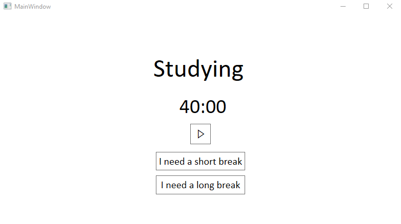

# Pomodoro
A quick and dirty pomodore implementation that still requires quite some work

ToDo's:
 - enable configuration of the different times
 - nicer notifications
 - proper logging of study-times (use UTC times)
 - plot study-times in histograms, ... (maybe use OxyPlot? https://stackoverflow.com/a/13630517)

Current view:

If you have any nice ideas, please feel free to share them with me :)